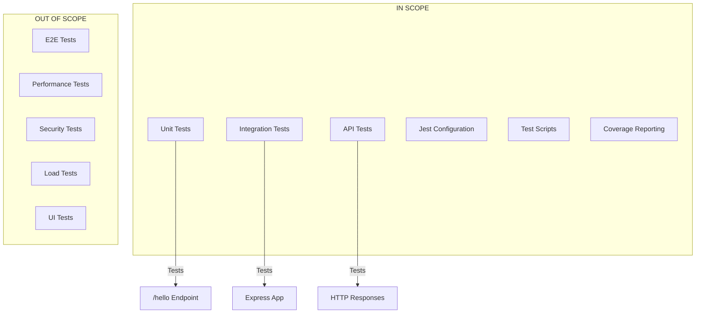

# Technical Specification

# 0. Agent Action Plan

## 0.1 Intent Clarification

### 0.1.1 Core Testing Objective

Based on the provided requirements, the Blitzy platform understands that the testing objective is to **create comprehensive unit and integration tests for a new Node.js tutorial project** featuring a single HTTP endpoint (`/hello`) that returns "Hello world" to HTTP clients.

**Request Categorization:** Add new tests (for a new product)

**Testing Requirements with Enhanced Clarity:**

- Create a complete test suite for a new Express.js application from scratch
- Test the `/hello` GET endpoint to verify it returns the expected "Hello world" response
- Validate HTTP status codes (200 OK) for successful requests
- Ensure response content-type and body format are correct
- Test error handling scenarios for the endpoint
- Establish test infrastructure including framework configuration, test runners, and coverage tools

**Implicit Testing Needs Surfaced:**

- **Edge Cases:** Testing behavior when the endpoint receives unexpected HTTP methods (POST, PUT, DELETE)
- **Error Handling:** Verifying proper error responses for malformed requests
- **Response Time Validation:** Ensuring endpoint responds within acceptable performance thresholds (<100ms)
- **Server Lifecycle:** Testing application startup and graceful shutdown
- **Content-Type Validation:** Ensuring proper HTTP headers in responses

### 0.1.2 Special Instructions and Constraints

**Critical Directives:**
- This is a **new product** - all test infrastructure must be created from scratch
- Follow Node.js/Express.js testing best practices and conventions
- Use industry-standard testing frameworks compatible with the Node.js ecosystem
- Ensure tests are maintainable, readable, and follow the AAA (Arrange-Act-Assert) pattern

**Testing Requirements:**
- Use Jest as the primary testing framework (industry standard for Node.js)
- Use Supertest for HTTP endpoint testing
- Follow conventional test file naming patterns (`*.test.js` or `*.spec.js`)
- Organize tests in a dedicated `tests/` or `__tests__/` directory

**User Example Preserved:**
> "Can you create a nodejs tutorial project that features one end point '/hello' that returns 'Hello world' to the calling HTTP client?"

**Web Search Requirements Documented:**
- Jest latest version compatibility with Node.js
- Supertest integration patterns with Express.js
- Best practices for Express.js endpoint testing

### 0.1.3 Technical Interpretation

These testing requirements translate to the following technical test implementation strategy:

- To **test the /hello endpoint**, we will create unit tests using Jest and Supertest that verify HTTP GET requests return status 200 with "Hello world" body
- To **validate response format**, we will create assertions checking Content-Type headers and response body structure
- To **ensure error handling**, we will create tests for unsupported HTTP methods returning appropriate 404/405 responses
- To **establish test infrastructure**, we will create Jest configuration, test scripts in package.json, and coverage reporting setup
- To **maintain code quality**, we will implement test coverage thresholds and linting for test files

### 0.1.4 Coverage Requirements Interpretation

**Explicit Coverage Targets:**
- No specific coverage percentage mentioned by user; applying industry standards

**Implicit Coverage Expectations:**

Based on industry standards for Node.js/Express.js applications:
- **Line Coverage Target:** ≥80% for application code
- **Branch Coverage Target:** ≥75% for conditional logic
- **Function Coverage Target:** ≥90% for exported functions

Based on existing patterns in the repository:
- Repository is empty (new product) - establishing baseline coverage standards

Based on critical path analysis:
- The `/hello` endpoint is the sole functionality - requires 100% coverage
- Application entry point and server configuration require testing
- Error handling paths must be covered

**To achieve comprehensive testing, coverage should include:**
- All route handlers (100% coverage for `/hello` endpoint)
- Application initialization and configuration
- Error middleware and 404 handlers
- Server startup and shutdown procedures


## 0.2 Test Discovery and Analysis

### 0.2.1 Existing Test Infrastructure Assessment

**Repository Analysis Results:**

The repository analysis reveals this is a **new product with no existing test infrastructure**. The repository contains only a `README.md` file with the heading "# 4thnov_3", indicating a fresh project requiring complete test setup from scratch.

**Search Patterns Employed:**
- Searched for test files matching: `*test*`, `*spec*`, `test_*`, `spec_*`, `*_test.*`, `*_spec.*` - **None found**
- Searched for testing framework in package files (package.json) - **No package.json exists**
- Searched for test configuration files (jest.config.*, .mocharc.*) - **None found**
- Searched for existing test suites - **None found**

**Findings Summary:**
> "Repository analysis reveals **no existing testing setup**. This is a greenfield project requiring complete test infrastructure creation including framework selection, configuration, and test file structure."

**Current Testing Framework Status:**

| Component | Status | Notes |
|-----------|--------|-------|
| Testing Framework | Not Installed | Jest recommended |
| Test Runner Configuration | Not Present | Requires jest.config.js |
| Coverage Tools | Not Installed | Jest built-in coverage |
| Mock/Stub Libraries | Not Present | Jest built-in mocking |
| HTTP Testing Library | Not Installed | Supertest recommended |
| Test Data Fixtures | Not Present | To be created |

### 0.2.2 Web Search Research Conducted

**Research Area 1: Best Practices for Jest Testing Patterns**

Key findings from industry research:
- Jest is the default test runner for JavaScript/Node.js projects, developed by Facebook
- Jest works out of the box with minimal configuration for Node.js projects
- Recommended test file organization: `__tests__/` directory or `*.test.js` naming convention
- Use `describe` blocks for grouping related tests and `it`/`test` for individual test cases

**Research Area 2: Recommended Mocking Strategies for Express.js**

Key findings:
- Supertest is the industry-standard library for testing HTTP servers in Node.js
- Supertest allows testing endpoints without starting an actual server
- Export the Express app separately from the server listener for testability
- Use Jest's built-in mocking for isolating dependencies

**Research Area 3: Test Organization Conventions for Node.js/Express**

Key findings:
- Separate app configuration from server startup for testability
- Create `app.js` for Express configuration and `server.js` for listening
- Place tests in `tests/` or `__tests__/` directory at project root
- Name test files to mirror source files (e.g., `app.test.js` for `app.js`)

**Research Area 4: Common Pitfalls to Avoid**

Key findings:
- Avoid starting the server in test files - use Supertest with the app directly
- Don't share state between tests - ensure test isolation
- Use `async/await` properly with Supertest for reliable assertions
- Configure proper test timeouts for HTTP requests


## 0.3 Testing Scope Analysis

### 0.3.1 Test Target Identification

**Primary Code to be Tested:**

| Module/File | Path | Test Types Required |
|-------------|------|---------------------|
| Express Application | `src/app.js` | Unit tests, Integration tests |
| Hello Route Handler | `src/routes/hello.js` | Unit tests, API tests |
| Server Entry Point | `src/server.js` | Integration tests |
| Application Index | `src/index.js` | Smoke tests |

**Functions Requiring Test Categories:**

| Function | Test Categories |
|----------|-----------------|
| `GET /hello` handler | Happy path, Response validation, Error cases |
| Express app configuration | Middleware setup, Route mounting |
| Server startup | Lifecycle tests, Port binding |
| 404 handler | Error handling, Response format |

**Existing Test File Mapping:**

| Source File | Existing Test File | Test Categories Present |
|-------------|-------------------|------------------------|
| `src/app.js` | None (to be created) | N/A |
| `src/routes/hello.js` | None (to be created) | N/A |
| `src/server.js` | None (to be created) | N/A |

**Dependencies Requiring Mocking:**

- **External Services:** None for this simple tutorial project
- **Database Interactions:** None - no database in scope
- **File System Operations:** None required
- **Environment Variables:** PORT configuration (if applicable)

### 0.3.2 Version Compatibility Research

Based on current Node.js ecosystem standards (November 2024), the recommended testing stack:

| Component | Package | Recommended Version | Rationale |
|-----------|---------|---------------------|-----------|
| Testing Framework | jest | 29.7.0 | Stable LTS version, widely supported, excellent Node.js compatibility |
| HTTP Testing | supertest | 7.1.4 | Latest stable version, full Express.js support |
| Coverage Tool | jest (built-in) | 29.7.0 | Integrated coverage with Jest, no additional package needed |
| Assertion Library | jest (built-in) | 29.7.0 | Jest includes expect assertions |

**Node.js Compatibility Notes:**
- Jest 29.x supports Node.js 14.15+, 16.10+, 18.0+, and 20.x
- Jest 30.x (latest) requires Node.js 18.x or higher
- For maximum compatibility with tutorial projects, Jest 29.7.0 is recommended
- Supertest 7.x is compatible with all modern Node.js versions

**Version Conflicts to Resolve:**
- None identified - all recommended packages are mutually compatible
- Ensure Node.js version is 18.x or higher for optimal compatibility

**Framework Selection Rationale:**

Jest was selected over alternatives (Mocha, Vitest, Node.js built-in test runner) because:
- Zero-configuration setup for Node.js projects
- Built-in assertion library, mocking, and coverage
- Excellent documentation and community support
- Industry standard for JavaScript/Node.js testing


## 0.4 Test Implementation Design

### 0.4.1 Test Strategy Selection

**Test Types to Implement:**

| Test Type | Focus Area | Priority |
|-----------|------------|----------|
| Unit Tests | Isolated route handler logic | High |
| Integration Tests | Full HTTP request/response cycle | High |
| Edge Case Tests | Invalid methods, malformed requests | Medium |
| Error Handling Tests | 404 responses, server errors | Medium |

**Unit Tests Focus:**
- Route handler function behavior in isolation
- Response body content validation
- Status code verification

**Integration Tests Focus:**
- Complete HTTP request through Express middleware stack
- End-to-end endpoint behavior with Supertest
- Response headers and content-type validation

**Edge Case Tests Focus:**
- Unsupported HTTP methods (POST, PUT, DELETE, PATCH) on `/hello`
- Requests to non-existent routes
- Malformed request handling

**Error Handling Tests Focus:**
- 404 Not Found responses for undefined routes
- Proper error response format
- Server error handling (500 responses)

### 0.4.2 Test Case Blueprint

**Component: GET /hello Endpoint**

```
Component: Hello Route Handler
Test Categories:
- Happy path: GET /hello returns 200 with "Hello world"
- Response validation: Content-Type is text/html or application/json
- Response validation: Response body exactly matches "Hello world"
- Edge cases: POST /hello returns 404 or 405
- Edge cases: PUT /hello returns 404 or 405
- Edge cases: DELETE /hello returns 404 or 405
- Performance: Response time under 100ms
```

**Component: Express Application**

```
Component: Express App Configuration
Test Categories:
- Happy path: App initializes without errors
- Happy path: Routes are properly mounted
- Error cases: 404 handler catches undefined routes
- Error cases: Error middleware handles exceptions
```

**Component: Server Lifecycle**

```
Component: Server Entry Point
Test Categories:
- Happy path: Server starts on configured port
- Happy path: Server responds to health checks
- Edge cases: Server handles port conflicts gracefully
- Cleanup: Server shuts down cleanly
```

### 0.4.3 Existing Test Extension Strategy

Since this is a new product with no existing tests:

- **Tests to Create:** All test files must be created from scratch
- **Tests to Extend:** N/A - no existing tests
- **Tests to Refactor:** N/A - no existing tests
- **Tests to Fix:** N/A - no existing tests

### 0.4.4 Test Data and Fixtures Design

**Required Test Data Structures:**

| Data Type | Purpose | Location |
|-----------|---------|----------|
| Expected Responses | Validate endpoint output | Inline in test files |
| HTTP Status Codes | Assert correct status | Constants in test utilities |
| Error Messages | Validate error responses | Inline in test files |

**Fixture Organization Strategy:**
- For this simple tutorial project, fixtures will be defined inline within test files
- No external fixture files required due to minimal data requirements

**Mock Object Specifications:**
- No external dependencies require mocking
- Jest's built-in mocking available if future extensions need it

**Test Database/State Management:**
- No database in scope
- Each test should be stateless and independent
- Use Jest's `beforeEach`/`afterEach` for any setup/teardown if needed


## 0.5 Test File Transformation Mapping

### 0.5.1 File-by-File Test Plan

**Test Transformation Modes:**
- **CREATE** - Create a new test file
- **UPDATE** - Update an existing test file
- **DELETE** - Remove an obsolete test file
- **REFERENCE** - Use as an example for test patterns and styles

| Target Test File | Transformation | Source File/Reference | Purpose/Changes |
|-----------------|----------------|----------------------|-----------------|
| `tests/app.test.js` | CREATE | `src/app.js` | Integration tests for Express app configuration, middleware, and route mounting |
| `tests/routes/hello.test.js` | CREATE | `src/routes/hello.js` | Unit and integration tests for /hello endpoint including happy path, edge cases, and error handling |
| `tests/server.test.js` | CREATE | `src/server.js` | Server lifecycle tests for startup and shutdown |
| `jest.config.js` | CREATE | N/A | Jest configuration file with test environment, coverage settings, and test patterns |

### 0.5.2 New Test Files Detail

**tests/app.test.js - Express Application Tests**

```
Test File: tests/app.test.js
Source: src/app.js
Test Categories:
- Happy path: App exports valid Express application
- Happy path: App has /hello route mounted
- Error cases: App returns 404 for undefined routes
Assertions Focus:
- Express app instance validation
- Route availability verification
- Middleware chain execution
```

**tests/routes/hello.test.js - Hello Endpoint Tests**

```
Test File: tests/routes/hello.test.js
Source: src/routes/hello.js
Test Categories:
- Happy path: GET /hello returns 200 status
- Happy path: Response body is "Hello world"
- Edge cases: POST /hello returns 404/405
- Edge cases: PUT /hello returns 404/405
- Edge cases: DELETE /hello returns 404/405
- Performance: Response time < 100ms
Mock Dependencies: None
Assertions Focus:
- HTTP status codes
- Response body content
- Response headers
```

**tests/server.test.js - Server Lifecycle Tests**

```
Test File: tests/server.test.js
Source: src/server.js
Test Categories:
- Happy path: Server starts successfully
- Happy path: Server listens on correct port
- Cleanup: Server closes gracefully
Assertions Focus:
- Server instance creation
- Port binding verification
```

### 0.5.3 Test Configuration Updates

| Config File | Purpose | Changes Required |
|-------------|---------|------------------|
| `jest.config.js` | Jest configuration | Create with testEnvironment: 'node', coverage settings, test patterns |
| `package.json` | NPM scripts | Add "test", "test:watch", "test:coverage" scripts |

**jest.config.js Configuration:**
```javascript
module.exports = {
  testEnvironment: 'node',
  coverageDirectory: 'coverage',
  collectCoverageFrom: ['src/**/*.js'],
  testMatch: ['**/tests/**/*.test.js'],
  verbose: true
};
```

**package.json Test Scripts:**
```json
{
  "scripts": {
    "test": "jest",
    "test:watch": "jest --watch",
    "test:coverage": "jest --coverage"
  }
}
```

### 0.5.4 Cross-File Test Dependencies

**Shared Fixtures:**
- Location: Inline within test files (no shared fixtures needed for this simple project)
- Usage: Each test file is self-contained

**Mock Objects:**
- Location: N/A - no external dependencies to mock
- Purpose: N/A

**Test Utilities:**
- Location: `tests/helpers/` (optional, create if needed)
- Helper functions: None required for initial implementation

**Import Updates Required:**
- All test files will import `supertest` for HTTP testing
- All test files will import the Express `app` from `src/app.js`
- No cross-test-file imports required

### 0.5.5 Complete Test File Inventory

| # | Test File Path | Status | Test Count (Est.) |
|---|---------------|--------|-------------------|
| 1 | `tests/app.test.js` | To Create | 3-4 tests |
| 2 | `tests/routes/hello.test.js` | To Create | 6-8 tests |
| 3 | `tests/server.test.js` | To Create | 2-3 tests |
| 4 | `jest.config.js` | To Create | Configuration |

**Total Estimated Tests:** 11-15 test cases

**Test Directory Structure:**
```
project-root/
├── src/
│   ├── app.js
│   ├── server.js
│   └── routes/
│       └── hello.js
├── tests/
│   ├── app.test.js
│   ├── server.test.js
│   └── routes/
│       └── hello.test.js
├── jest.config.js
└── package.json
```


## 0.6 Dependency Inventory

### 0.6.1 Testing Dependencies

All key testing packages relevant to this testing exercise:

| Registry | Package Name | Version | Purpose |
|----------|--------------|---------|---------|
| npm | jest | 29.7.0 | JavaScript testing framework with built-in assertions, mocking, and coverage |
| npm | supertest | 7.1.4 | HTTP assertions library for testing Express.js endpoints |
| npm | @types/jest | 29.5.14 | TypeScript definitions for Jest (optional, for IDE support) |

**Version Selection Rationale:**

- **jest@29.7.0**: Selected as the stable LTS version with excellent Node.js 18+ support. While Jest 30.x is available, 29.7.0 provides maximum stability and compatibility for tutorial projects.
- **supertest@7.1.4**: Latest stable version providing full Express.js integration and modern async/await support.
- **@types/jest@29.5.14**: Matches Jest 29.x for consistent type definitions (optional but recommended for IDE autocomplete).

### 0.6.2 Application Dependencies (Required for Testing)

The following application dependencies must be installed for the tests to function:

| Registry | Package Name | Version | Purpose |
|----------|--------------|---------|---------|
| npm | express | 4.21.1 | Web framework for Node.js (application dependency) |

### 0.6.3 Development Dependencies Summary

Complete `devDependencies` section for `package.json`:

```json
{
  "devDependencies": {
    "jest": "^29.7.0",
    "supertest": "^7.1.4"
  }
}
```

### 0.6.4 Import Updates

**Test Files Requiring Import Updates:**

Since this is a new project, all imports will be established fresh:

| Test File | Required Imports |
|-----------|------------------|
| `tests/app.test.js` | `const request = require('supertest');`<br>`const app = require('../src/app');` |
| `tests/routes/hello.test.js` | `const request = require('supertest');`<br>`const app = require('../../src/app');` |
| `tests/server.test.js` | `const app = require('../src/app');` |

**Import Pattern Standards:**

```javascript
// Standard test file imports
const request = require('supertest');
const app = require('../src/app');
```

### 0.6.5 Package Installation Commands

**Install All Testing Dependencies:**
```bash
npm install --save-dev jest@29.7.0 supertest@7.1.4
```

**Install Application Dependencies:**
```bash
npm install express@4.21.1
```

**Combined Installation (Recommended):**
```bash
npm install express@4.21.1
npm install --save-dev jest@29.7.0 supertest@7.1.4
```


## 0.7 Coverage and Quality Targets

### 0.7.1 Coverage Metrics

**Current Coverage Status:**
- Current coverage: 0% (new project with no existing tests)

**Target Coverage Based on Industry Best Practices:**

| Metric | Target | Rationale |
|--------|--------|-----------|
| Line Coverage | ≥80% | Industry standard for production code |
| Branch Coverage | ≥75% | Ensures conditional logic is tested |
| Function Coverage | ≥90% | All exported functions should be tested |
| Statement Coverage | ≥80% | Comprehensive code execution |

**Coverage Gaps to Address:**

| Component | Current | Target | Focus Areas |
|-----------|---------|--------|-------------|
| `src/app.js` | 0% | 100% | Express configuration, route mounting |
| `src/routes/hello.js` | 0% | 100% | Route handler, response generation |
| `src/server.js` | 0% | 80% | Server startup (some lifecycle code may be excluded) |

**Per-File Coverage Targets:**

| File | Line Target | Branch Target | Notes |
|------|-------------|---------------|-------|
| `src/app.js` | 100% | 100% | Core application - full coverage required |
| `src/routes/hello.js` | 100% | 100% | Primary endpoint - full coverage required |
| `src/server.js` | 80% | 75% | Server lifecycle may have untestable paths |

### 0.7.2 Test Quality Criteria

**Assertion Density Expectations:**
- Minimum 2 assertions per test case
- Each test should verify both status code and response content
- Edge case tests should verify error response format

**Test Isolation Requirements:**
- Each test must be independent and runnable in isolation
- No shared mutable state between tests
- Use `beforeEach`/`afterEach` for setup/teardown if needed
- Tests should pass regardless of execution order

**Performance Constraints:**
- Individual test execution: < 500ms
- Full test suite execution: < 5 seconds
- HTTP endpoint response time assertion: < 100ms

**Maintainability Standards:**
- Follow AAA pattern (Arrange-Act-Assert) in all tests
- Use descriptive test names that explain expected behavior
- Group related tests using `describe` blocks
- Keep test files focused on single modules

**Repository Test Pattern Conventions:**
- Test file naming: `*.test.js`
- Test directory: `tests/` at project root
- Mirror source directory structure in tests
- Use Jest's built-in matchers for assertions

### 0.7.3 Coverage Configuration

**Jest Coverage Settings (jest.config.js):**

```javascript
module.exports = {
  collectCoverage: true,
  coverageDirectory: 'coverage',
  coverageReporters: ['text', 'lcov', 'html'],
  collectCoverageFrom: [
    'src/**/*.js',
    '!src/server.js' // Exclude server entry if needed
  ],
  coverageThreshold: {
    global: {
      branches: 75,
      functions: 90,
      lines: 80,
      statements: 80
    }
  }
};
```

### 0.7.4 Quality Gates

**Pre-Commit Quality Checks:**
- All tests must pass
- Coverage thresholds must be met
- No skipped tests in final submission

**Continuous Integration Criteria:**
- Test suite completes without failures
- Coverage report generated
- Coverage does not decrease from baseline


## 0.8 Scope Boundaries

### 0.8.1 Exhaustively In Scope

**New Test Files:**
- `tests/**/*.test.js` - All new unit and integration tests
- `tests/app.test.js` - Express application tests
- `tests/routes/**/*.test.js` - Route handler tests
- `tests/routes/hello.test.js` - Hello endpoint tests
- `tests/server.test.js` - Server lifecycle tests

**Test Configuration Files:**
- `jest.config.js` - Jest framework configuration
- `package.json` - Test scripts and devDependencies

**Test Utilities and Helpers:**
- `tests/helpers/**/*.js` - Shared test utilities (if needed)

**Documentation Updates:**
- `README.md` - Testing section with instructions

**Source Files (Required for Testability):**
- `src/app.js` - Express application configuration
- `src/routes/hello.js` - Hello route handler
- `src/server.js` - Server entry point
- `src/index.js` - Application index (if applicable)

### 0.8.2 Explicitly Out of Scope

**Testing Types Excluded:**
- End-to-end (E2E) testing - Not required for this tutorial project
- Performance/load testing - Beyond scope of unit testing
- Security testing and vulnerability scanning - Not in scope
- Browser-based UI automation - Backend-only project
- Stress and scalability testing - Not applicable

**Code Modifications Excluded:**
- Database integration - No database in this project
- Authentication/authorization - Not part of requirements
- External API integrations - Not required
- Caching mechanisms - Not in scope
- Logging infrastructure - Basic only

**Infrastructure Excluded:**
- CI/CD pipeline configuration - Platform handles internally
- Docker containerization - Not required
- Cloud deployment configuration - Not in scope
- Monitoring and alerting setup - Not required

**Items Explicitly Excluded Per Technical Specification:**
- Performance, load, stress, and scalability testing (per Section 6.6)
- Security testing and vulnerability scanning (per Section 6.6)
- End-to-end (E2E) testing (per Section 6.6)
- Browser-based UI automation (backend-only project)

### 0.8.3 Scope Boundary Diagram



### 0.8.4 Scope Decision Matrix

| Item | In Scope | Out of Scope | Rationale |
|------|----------|--------------|-----------|
| Unit tests for route handlers | ✓ | | Core testing requirement |
| Integration tests for endpoints | ✓ | | Validates HTTP behavior |
| Jest framework setup | ✓ | | Required test infrastructure |
| Supertest HTTP testing | ✓ | | Industry standard for Express |
| Coverage reporting | ✓ | | Quality assurance |
| E2E browser testing | | ✓ | Backend-only project |
| Performance benchmarking | | ✓ | Beyond tutorial scope |
| Security scanning | | ✓ | Not specified in requirements |
| Database testing | | ✓ | No database in project |
| CI/CD configuration | | ✓ | Platform handles internally |


## 0.9 Execution Parameters

### 0.9.1 Testing-Specific Instructions

**Test Execution Commands:**

| Command | Purpose | Usage |
|---------|---------|-------|
| `npm test` | Run all tests once | CI/CD, pre-commit |
| `npm run test:watch` | Run tests in watch mode | Development |
| `npm run test:coverage` | Run tests with coverage report | Quality checks |
| `npm run test:verbose` | Run tests with detailed output | Debugging |

**Exact Commands:**

```bash
# Run all tests
npm test

#### Run tests with coverage
npm run test:coverage

#### Run tests in watch mode (development)
npm run test:watch

#### Run specific test file
npm test -- tests/routes/hello.test.js

#### Run tests matching pattern
npm test -- --testNamePattern="hello"
```

### 0.9.2 Package.json Scripts Configuration

```json
{
  "scripts": {
    "test": "jest",
    "test:watch": "jest --watch",
    "test:coverage": "jest --coverage",
    "test:verbose": "jest --verbose",
    "test:ci": "jest --ci --coverage --watchAll=false"
  }
}
```

### 0.9.3 Environment Setup Requirements

**Node.js Version:**
- Minimum: Node.js 18.x
- Recommended: Node.js 20.x LTS

**Environment Variables:**
- `NODE_ENV=test` - Automatically set by Jest
- `PORT` - Optional, defaults to 3000 if not set

**Pre-Test Setup:**
```bash
# Install dependencies
npm install

#### Verify Jest installation
npx jest --version
```

### 0.9.4 Test Patterns and Conventions

**Test File Patterns:**
- Pattern: `**/*.test.js`
- Location: `tests/` directory
- Naming: Mirror source file names with `.test.js` suffix

**Test Organization:**
```javascript
describe('Module Name', () => {
  describe('Function/Feature', () => {
    it('should behave correctly when...', () => {
      // Arrange
      // Act
      // Assert
    });
  });
});
```

**Assertion Patterns:**
```javascript
// Status code assertion
expect(response.status).toBe(200);

// Body content assertion
expect(response.text).toBe('Hello world');

// Header assertion
expect(response.headers['content-type']).toMatch(/text/);
```

### 0.9.5 Debug Mode Execution

**Running Tests in Debug Mode:**
```bash
# Debug with Node inspector
node --inspect-brk node_modules/.bin/jest --runInBand

#### Debug specific test
node --inspect-brk node_modules/.bin/jest --runInBand tests/routes/hello.test.js
```

**VS Code Debug Configuration (launch.json):**
```json
{
  "type": "node",
  "request": "launch",
  "name": "Jest Debug",
  "program": "${workspaceFolder}/node_modules/.bin/jest",
  "args": ["--runInBand"],
  "console": "integratedTerminal"
}
```

### 0.9.6 CI/CD Integration

**Non-Interactive Test Execution:**
```bash
# CI-safe command (no watch mode, exits with code)
CI=true npm test -- --watchAll=false

#### With coverage and CI reporter
npm run test:ci
```

**Exit Codes:**
- `0` - All tests passed
- `1` - One or more tests failed
- Coverage threshold failures also return `1`


## 0.10 Special Instructions for Testing

### 0.10.1 Testing-Specific Requirements

**New Product Testing Guidelines:**

Since this is a new product creation, the following special instructions apply:

- **Create Complete Test Infrastructure:** All test files, configurations, and utilities must be created from scratch
- **Follow Express.js Testing Best Practices:** Separate app configuration from server startup for testability
- **Use Industry-Standard Tools:** Jest + Supertest combination is the recommended stack
- **Establish Baseline Coverage:** Set up coverage thresholds from the start

### 0.10.2 Code Organization for Testability

**Application Structure Requirements:**

The source code must be organized to support testing:

```javascript
// src/app.js - Export app without listening
const express = require('express');
const app = express();
// ... middleware and routes
module.exports = app;

// src/server.js - Import app and listen
const app = require('./app');
app.listen(PORT);
```

**Rationale:** Exporting the Express app separately allows Supertest to test endpoints without starting an actual server, preventing port conflicts and enabling parallel test execution.

### 0.10.3 Test Isolation Requirements

- **DO NOT** share state between tests
- **DO NOT** rely on test execution order
- **DO** use `beforeEach`/`afterEach` for setup/teardown
- **DO** ensure each test can run independently
- **DO** clean up any resources after tests complete

### 0.10.4 Mocking Guidelines

For this simple tutorial project:

- **No external dependencies require mocking**
- Jest's built-in mocking is available for future extensions
- If mocking is needed, use Jest's `jest.mock()` or `jest.spyOn()`

### 0.10.5 Test Naming Conventions

**Describe Block Naming:**
```javascript
describe('GET /hello', () => { ... });
describe('Express App', () => { ... });
```

**Test Case Naming:**
```javascript
it('should return 200 status code', () => { ... });
it('should return "Hello world" in response body', () => { ... });
it('should return 404 for POST requests', () => { ... });
```

**Pattern:** `should [expected behavior] when [condition]`

### 0.10.6 Async/Await Best Practices

**Correct Pattern with Supertest:**
```javascript
it('should return Hello world', async () => {
  const response = await request(app).get('/hello');
  expect(response.status).toBe(200);
  expect(response.text).toBe('Hello world');
});
```

**Avoid:**
- Callback-based assertions (use async/await)
- Missing `await` on Supertest requests
- Forgetting to return promises in tests

### 0.10.7 Error Handling in Tests

**Testing Error Responses:**
```javascript
it('should return 404 for undefined routes', async () => {
  const response = await request(app).get('/undefined');
  expect(response.status).toBe(404);
});
```

**Testing Method Not Allowed:**
```javascript
it('should return 404 for POST to /hello', async () => {
  const response = await request(app).post('/hello');
  expect(response.status).toBe(404);
});
```

### 0.10.8 Performance Assertions

**Response Time Validation:**
```javascript
it('should respond within 100ms', async () => {
  const start = Date.now();
  await request(app).get('/hello');
  const duration = Date.now() - start;
  expect(duration).toBeLessThan(100);
});
```

### 0.10.9 Documentation Requirements

**README.md Testing Section:**

The README should include:
- How to install test dependencies
- How to run tests
- How to generate coverage reports
- Test file organization explanation

### 0.10.10 Final Checklist

Before considering testing complete:

- [ ] All test files created and passing
- [ ] Jest configuration complete
- [ ] Coverage thresholds met (≥80% lines)
- [ ] Test scripts added to package.json
- [ ] README updated with testing instructions
- [ ] No skipped or pending tests
- [ ] All edge cases covered
- [ ] Error handling tested


